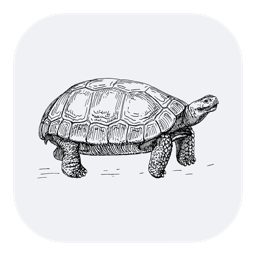

<p align="center">
  
</p>

<h1 align="center">Frank</h1>

<p align="center">
  <em>A quiet GitHub pull-request reporter for the macOS menu bar.</em>
</p>

<p align="center">
  
  
  
</p>

---

Frank watches the pull requests you authored or commented on and notifies you only when
something changes that you'd act on. Everything else waits in the panel until you ask.

## Features

- **Menu bar state.** Hollow tortoise: all fine. Filled: one of your own PRs has failing
  CI or changes requested. Watched PRs don't affect the icon.
- **Panel.** PRs grouped into Mine and Watching. Each row shows author avatar, CI badge,
  title, repo, approvals, coloured diff size, age, and a `jira ↗` link. A dot capsule
  expands into the individual checks, and failed ones click through to the run.
- **Notifications.** Four immediate triggers: CI passes, CI fails, approval, changes
  requested. One banner per transition, none on first sighting. Comments from other
  people batch into one digest per half hour. Your own don't count. Clicking a banner
  opens the PR.
- **Restart-safe.** Seen-state persists, so a relaunch replays nothing, and a transition
  that happened while quit fires once.
- **Launch at login.** A checkbox in the panel footer, registered through
  `SMAppService`, revocable there or in System Settings.

## Install

Frank builds from source, deliberately: an unsigned binary download would trip
Gatekeeper, whereas a locally built app launches without ceremony.

### For humans

You need three things:

1. **macOS 15 or newer.** Check with `sw_vers -productVersion`.
2. **A Swift 6 toolchain.** Either Xcode from the App Store or the Command Line
   Tools (`xcode-select --install`). Check that `swift --version` reports 6.x.
3. **An authenticated [`gh` CLI](https://cli.github.com).** Install with
   `brew install gh`, sign in with `gh auth login`. Frank borrows its token
   rather than asking you to sign in again.

Then:

```sh
git clone https://github.com/angie/frank.git
cd frank
scripts/install.sh
```

That builds a release bundle, installs it to `~/Applications/Frank.app`, and opens
it. macOS asks once for notification permission. Installing outside `.build` keeps
the login-item and notification registrations alive across `swift package clean`.

macOS won't grant a bare executable a status item or notification rights, so the
build script wraps one in a minimal bundle. If the tortoise doesn't appear after
launch, check your menu bar manager's hidden section.

For a throwaway run from the working tree instead:
`scripts/make-app.sh && open .build/Frank.app`.

### For agents

```sh
# Preconditions — if any fail, stop and ask your human.
sw_vers -productVersion   # 15.0 or newer
swift --version           # Swift 6.x
gh auth status            # an authenticated account that can read the user's PRs

git clone https://github.com/angie/frank.git
cd frank
swift test                # the suite must pass before installing
scripts/install.sh        # builds and installs ~/Applications/Frank.app, then opens it

# Verify.
pgrep -x Frank            # prints a PID when the app is running
```

Two interactive steps belong to the human: `gh auth login` and macOS's one-time
notification-permission prompt. The install script kills any running Frank
before replacing it.

To smoke-test notifications without waiting for CI:

```sh
FRANK_TEST_NOTIFICATION="hello" ~/Applications/Frank.app/Contents/MacOS/Frank
```

## Jira links

A browse link in the PR body wins. Failing that, Frank combines the ticket key from the
title with a Jira base learned from your other PRs' bodies. No configuration and no
network validation.

## Development

Core logic lives in `FrankCore` (polling, transition detection, digest buffer,
presenters), all pure and tested; the `Frank` target is a thin SwiftUI shell.

```sh
swift test
```

Changes follow RED → GREEN → MUTATE → KILL MUTANTS → REFACTOR. Mutation testing
stays manual until muter's Swift Testing fix (PR #306) gets released.

## Licence

[MIT](LICENSE).

## Credits

Icon tortoise: public-domain engraving from
[Openclipart](https://openclipart.org/detail/124111/tortoise). Regenerate with
`scripts/make-icon.sh`.

## Roadmap

- Coloured attention dot in the menu bar (blocked on `MenuBarExtra` label rendering;
  needs a custom appearance-aware `NSImage`)
- Quiet hours / Focus awareness, per-repo mute, pin list, review-requested scope,
  Sparkle updates
- Digest window resets on relaunch (worst case: one early digest)
